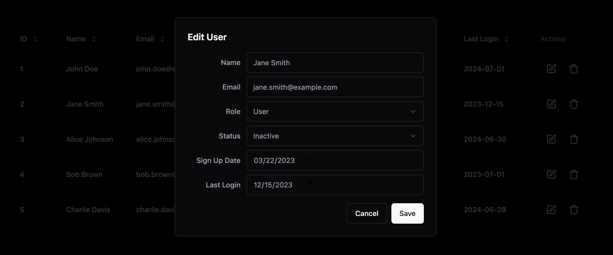

# React User Management Table

This project demonstrates a simple React application implementing a user management table. It uses React components and `Context API` with a `reducer` for state management. The application is styled with Tailwind CSS and uses various components from Shadcn UI for a clean and modern user interface.

## Features

- **User Display**: Displays attributes like ID, Name, Email, Role, Status, Sign Up Date, and Last Login in a table format.
- **Edit User**: Users can edit any attribute using a modal dialog. State management is handled using React Context and useReducer.
- **Delete User**: Users can be deleted directly from the table with immediate effect, also managed by React Context and useReducer.
- **Design**: Styled using Tailwind CSS for layout and Shadcn UI components like buttons, dialogs, and tables for functionality and aesthetics.

## Screenshots

**Wide Screen**


**Edit User**


**Delete User**


## Technologies Used

- **ReactJS**: For building the user interface.
- **Tailwind CSS**: For styling and layout.
- **Shadcn UI**: Used for various UI components:
  - `alert-dialog.tsx` for alerts
  - `button.tsx` for buttons
  - `dropdown-menu.tsx` for dropdown menus
  - `input.tsx` for form inputs
  - `label.tsx` for input labels
  - `select.tsx` for select boxes
  - `table.tsx` for the user table

## Setup and Installation

1. Clone the repository:
   ```
   git clone https://github.com/parthasarathydNU/apigen.git
   ```
2. Navigate to the project directory:
   ```
   cd apigen
   ```
3. Install dependencies:
   ```
   npm install
   ```
4. Start the development server:
   ```
   npm run start
   ```

## Usage

Once the development server is running, you can view the application in your browser at `http://localhost:3000`. The application will display a table of users, with options to edit or delete each user via the UI components.

## Contributing

Contributions are welcome! For major changes, please open an issue first to discuss what you would like to change.

## License

[MIT License](LICENSE.md)
